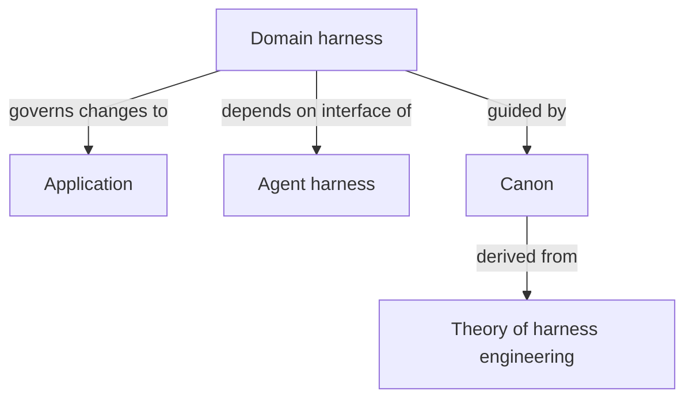

# Harness components

The harness is a vague [overloaded term](./overloaded-terms.md) in the industry that encompasses a wide variety of traits.  The concept can be broken out into pieces, and those pieces are the _components_ of the harness.

## Five components of a harnessed application

Each component of the harness is independent and exists with its own dependencies and awareness of other components.  The harness is not _layered_ in the sense that each builds on the other, instead they form more of a _graph_.

### Application

The [application](./application-architect.md) is the core target.  It is what everything is acting on.  It could be a SaaS platform.  It could be a book.  It can be operated on with or without LLMs.

### Agent harness

Everything that Claude Code, Codex, or Opencode does is the agent harness.  These tools equip LLMs with the basic capabilities of reading and writing.  They offer building blocks for users to form processes and manage context.  Fundamentally they have no awareness of what it is working on.

* **Tool execution & fundamental tools**: Read, Write, Grep, MCP, run CLI commands
* **Context Management**: Skills, Compaction, Research, Memory
* **Fundamental processes**: Spawn subagents, extract intent, reason
* **Model**: The model itself, (Deepseek, Opus, ChatGPT)

### Domain harness

What the agent does is up to the user.  The domain harness provides agents with information and tools.  The purpose of the domain harness is to enable the user to achieve a goal effectively through an agent.  The goal is arbitrary, it could be to write a piece of code, ideate on a concept, diagnose production issues, or onboard a new user to the system.

All domain harness traits are specific to the domain itself.  This includes your application's dependencies.  If your application uses infrastructure as code, terraform documentation or MCPs are part of your domain.  

* **Tools**: Enable the agent to execute instructions
* **MCP Integrations**: Enable the agent to reach external systems to acquire information
* **Context**: Any information that is available to the agent via progressive disclosure (markdown, html, etc)

The domain harness governs the application.  It contains everything agents need to know to manage the system.  It is the crystallization of all knowledge from all of the people working around that system.

### Canon

If the domain harness governs the application, the canon governs the domain harness.  The canon is the context that enables a [self-managed harness](./agent-managed-tooling.md) to exist.

* **Retrospectives**: Enable agents to evaluate the processes that occurred over a time period to improve the domain harness
* **Context Management**: Ensure the domain harness is complete and correct
* **Feedback Processing**: Enable users to provide feedback that shapes the harness

The recursive nature of automated governance currently terminates at the Canon.  The Canon is self governing.

> **NOTE**: Conceptually, this repository is an odd example of both the application and the theory of harness engineering -- it has its own agentic harness, its own workspace, and its own Canon that is derived from itself.

### Theory of harness engineering

This repository of information is the theory of harness engineering.  In the current state (Spring of 2026), the theory of harness engineering is 100% human.  We theorize, we explore concepts, and we make changes to our Canon, to our Domain Harness, and to our Agent Harness.

In the future, it is feasible that agents themselves will manage the theory of harness engineering.

> **NOTE**: Much of the content within this [knowledge graph](./intuition-network.md) is derived from conversations with LLMs, not humans.  We are in an era (Spring 2026) where pushing the frontier of physics is done using LLMs and so we can find acceptance in embracing the use of LLMs to push the theory of harness engineering.

## How the components relate

The relationships between the components resemble the same type of structures that we have historically used when defining the relationships between components in an application.  They are comprised of interfaces and implementations.

* **Application**: Represents the core target of the model
  * The application is agnostic to all harness components
* **Agent Harness**: Exists independently and fulfills the contracts that we expect (managing the agents)
* **Domain Harness**:  Depends on the Agent Harness interface, the Application, and the Canon
  * Knows about the concepts that exist within Claude Code, Codex, or OpenCode, but it doesn't know about the details
  * Has intimate coupling to the application
  * Aware of the guiding principles of the Canon
* **Canon**:  Exists independently and provides the principles and rules for any domain harness to follow
  * Enables and guides **workflows** that enable autonomous agent harness improvements
  * Built from the theory of harness engineering
* **Theory of harness engineering**: Completely independent

